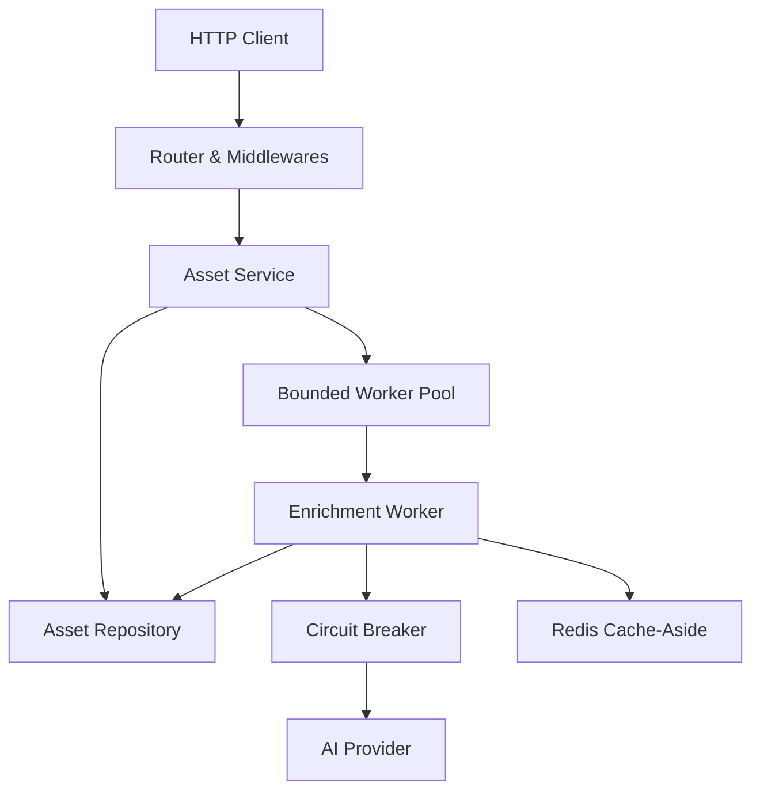

# MediaPulse AI

[](https://github.com/silasms/media-pulse-ai/actions)
[](LICENSE)
[](https://golang.org)

Microsserviço em Go para ingestão contínua e enriquecimento de metadados audiovisuais com inteligência artificial para plataformas de streaming e ecossistemas digitais de streaming.

Principais responsabilidades:
- Geração de sinopses e resumos estruturados
- Segmentação de capítulos e cenas com minutagem
- Classificação indicativa automática recomendada
- Extração de temas, tags e sentimento narrativo
- Geração de embeddings vetoriais (384 dimensões) para busca semântica

## Arquitetura

O projeto segue Clean Architecture / Ports & Adapters:



## Como Executar

### Localmente

```bash
git clone https://github.com/silasms/media-pulse-ai.git
cd media-pulse-ai
go mod download
make test
make run
```

A API inicia por padrão na porta `8080`.

### Docker Compose

```bash
make docker-up
```

## Endpoints

| Método | Rota | Descrição |
|---|---|---|
| `POST` | `/api/v1/assets` | Ingestão de mídia e agendamento de enriquecimento |
| `GET` | `/api/v1/assets/{id}` | Busca de ativo por ID (com cache-aside) |
| `GET` | `/api/v1/assets` | Listagem paginada com filtro por status |
| `POST` | `/api/v1/assets/{id}/enrich` | Disparo manual de enriquecimento |
| `GET` | `/health/live` | Liveness probe |
| `GET` | `/health/ready` | Readiness probe |
| `GET` | `/metrics` | Métricas operacionais em formato Prometheus |

### Exemplo de Ingestão

```bash
curl -X POST http://localhost:8080/api/v1/assets \
  -H "Content-Type: application/json" \
  -d '{
    "title": "Tech Insights - Especial de Tecnologia",
    "description": "Reportagem sobre avanços de inteligência artificial",
    "duration_seconds": 2700,
    "media_url": "https://cdn.example.com/vod/tech-insights.mp4",
    "language": "pt-BR"
  }'
```

## Testes & Benchmarks

```bash
make test
make benchmark
```

## Autor

Silas Medeiros ([@silasms](https://github.com/silasms))  
silas.medeiros7@gmail.com
